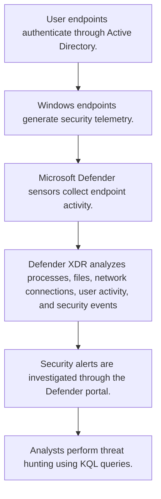

# Security Data Flow 

```mermaid
flowchart TD

A[User endpoints authenticate through Active Directory.] --> B[Windows endpoints generate security telemetry.]
B --> C[Microsoft Defender sensors collect endpoint activity.]
C --> D[Defender XDR analyzes processes, files, network connections, user activity, and security events]
D --> E[Security alerts are investigated through the Defender portal.]
E --> F[Analysts perform threat hunting using KQL queries.]
```
